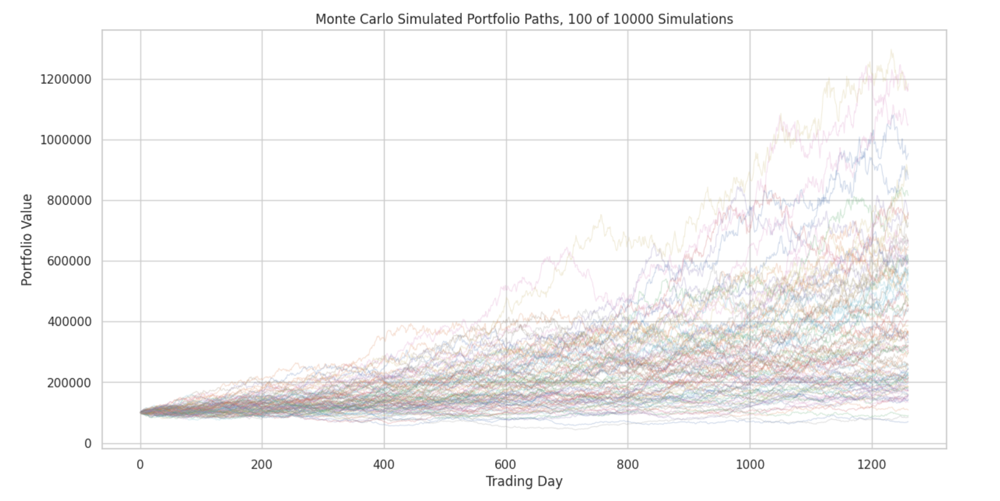
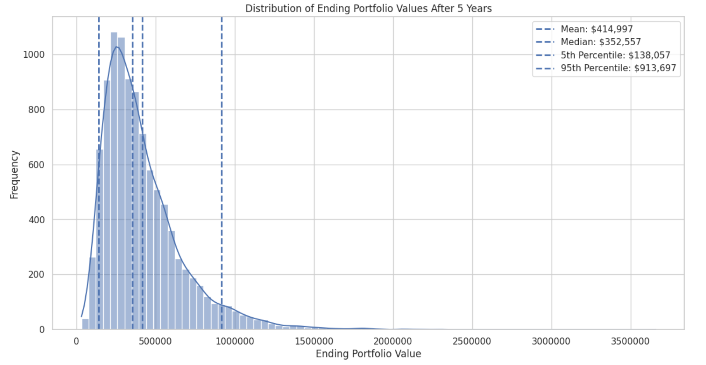
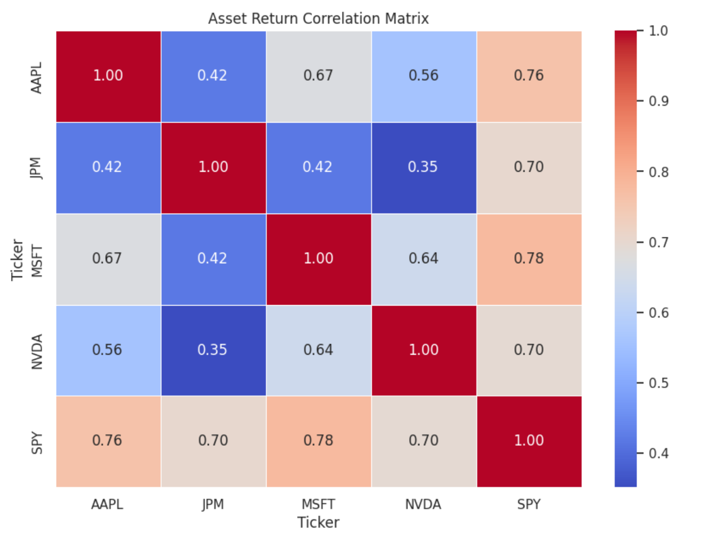
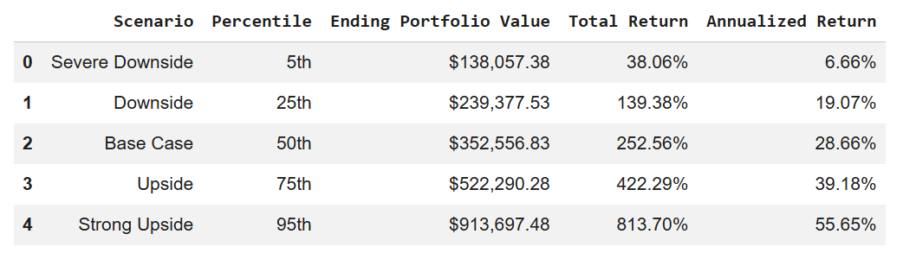
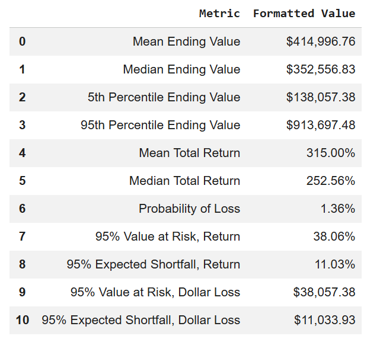

# Monte Carlo Portfolio Risk Simulator

This project uses Python to simulate future portfolio outcomes using historical stock market data. The model pulls real asset prices from Yahoo Finance, calculates portfolio return and volatility, and runs 10,000 Monte Carlo simulations to estimate downside risk, expected return, Value at Risk, and expected shortfall.

## Tools Used
- Python
- Google Colab
- pandas
- numpy
- yfinance
- matplotlib
- seaborn
- plotly

## Key Features
- Downloads real stock price data
- Calculates daily and annualized returns
- Measures portfolio volatility and Sharpe ratio
- Builds a correlation matrix
- Calculates historical drawdown
- Runs 10,000 Monte Carlo simulations
- Estimates Value at Risk and expected shortfall
- Creates scenario tables and professional charts

## Portfolio Example
The default portfolio includes:
- Apple
- Microsoft
- Nvidia
- JPMorgan
- S&P 500 ETF

## Results
The notebook estimates expected portfolio value, downside scenarios, probability of loss, and risk-adjusted return over a multi-year forecast period.

## Project Output Examples

### Monte Carlo Simulation Paths

### Ending Portfolio Value Distribution

### Correlation Matrix

### Scenario Table

### Risk Metrics

